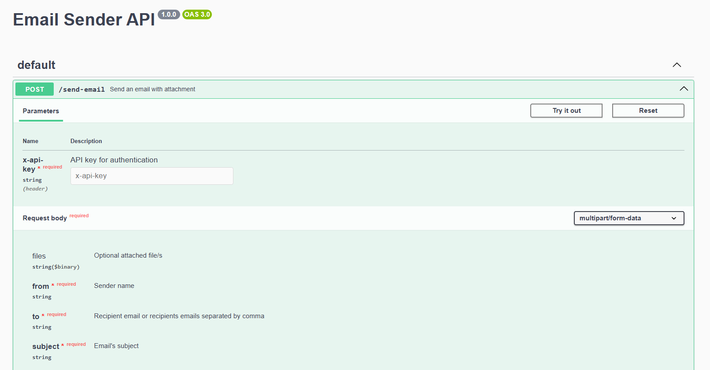

# Email Sender API

A lightweight API for sending emails in plain text or HTML templates, with optional files attachment.

## Features

- Send emails in plain text or HTML format
- Attach files
- CORS and API key protection
- Rate limit protection
- Limit file size and number of files
- Ready to run with Docker or locally

## Tech Stack

[Express](https://expressjs.com/)

[Docker Compose](https://docs.docker.com/compose/)

[Swagger UI](https://swagger.io/tools/swagger-ui/)

[Nodemailer](https://expressjs.com/)

## Prerequisites

[Node.js](https://nodejs.org/)

[Docker (optional)](https://www.docker.com/)

## Instructions


### 1. Create .env file and set the following variables and set the corresponding values 

```
ENVIROMENT=local
PORT=9000
LOG_LEVEL=debug

SMTP_HOST=your.mail.host
SMTP_PORT=000
SMTP_EMAIL=example@mail.com
SMTP_PASS=pass

API_KEYS="api_key"
ALLOWED_CORS_DOMAINS="http://localhost:9000,http://otherdomain"

RATE_LIMIT_WINDOW_MS=900000
RATE_LIMIT_MAX=100

FILE_SIZE=5242880
FILES_LIMIT=5
```

#### 1.1 Rate limit variables

- `RATE_LIMIT_WINDOW_MS`: Time window in milliseconds for rate limit
- `RATE_LIMIT_MAX`: Maximum number of requests allowed in the time window

#### 1.2 File upload variables

- `FILE_SIZE`: Maximum file size in bytes
- `FILES_LIMIT`: Maximum number of files allowed

### 2. Run the app

#### Local

```bash
npm i
```

```bash
npm run dev
```

#### Docker

```bash
docker compose build
```

```bash
docker compose up
```

### 3. Access the API

App available at port 9000 (or defined port in enviroment variables)

http://localhost:9000

## API Docs

API documentation is served at:

http://localhost:9000/api-docs



## Example requests

### 1. Send email with text

```bash
curl -X POST http://localhost:9000/send-email \
  -H "Content-Type: multipart/form-data" \
  -H "X-Api-Key: api_key" \
  -F "from=Test" \
  -F "to=test@example.com" \
  -F "subject=Test" \
  -F "text=Hello"
```

### 2. Send email with HTML template

```bash
curl -X POST http://localhost:9000/send-email \
  -H "Content-Type: multipart/form-data" \
  -H "X-Api-Key: api_key" \
  -F "from=Test" \
  -F "to=test@example.com" \
  -F "subject=Test" \
  -F "html=<div>Test</div>"
```

### 3. Send email with files attachment

```bash
curl -X POST http://localhost:9000/send-email \
  -H "Content-Type: multipart/form-data" \
  -H "X-Api-Key: api_key" \
  -F "from=Test" \
  -F "to=test@example.com" \
  -F "subject=Test" \
  -F "text=Hello" \
  -F "files=@/path/to/file1" \
  -F "files=@/path/to/file2"
```