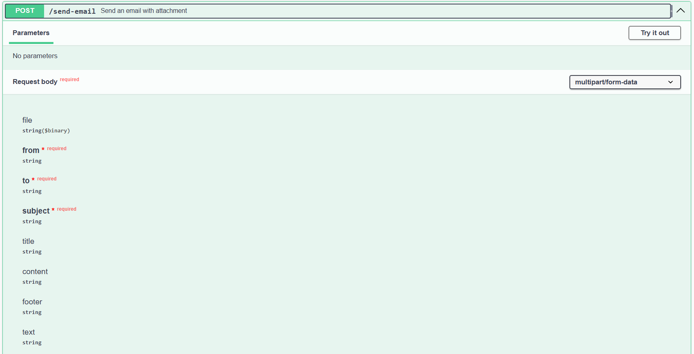

 # Email Sender API

 Send emails in text plain or html template. You can also attach files.

## Notes

- The sender email must be a Gmail address. If this doesn’t fit your use case, update the transport function in ./src/utils/mailer.js according to Nodemailer docs.

- The email template can be modified in ./src/utils/template.js

## Tech Stack

[Express](https://expressjs.com/)
[Nodemailer](https://expressjs.com/)

## Instructions

### 1. Generate email App password 

https://myaccount.google.com/apppasswords

### 2. Create .env file and set variables

```
ENVIROMENT=local
PORT=9000
SMTP_EMAIL=example@gmail.com
SMTP_PASS="google app pass"
API_KEY="api_key"
ALLOWED_CORS_DOMAINS="http://localhost:9000,http://otherdomain"
```

### 3. Run app with Docker or local

#### Local

```
npm i
```
```
npm run dev
```

#### Docker

```
docker compose build
```

```
docker compose up
```

### 4. App ready at port 9000 (or defined port)


## Docs

http://localhost:9000/api-docs

