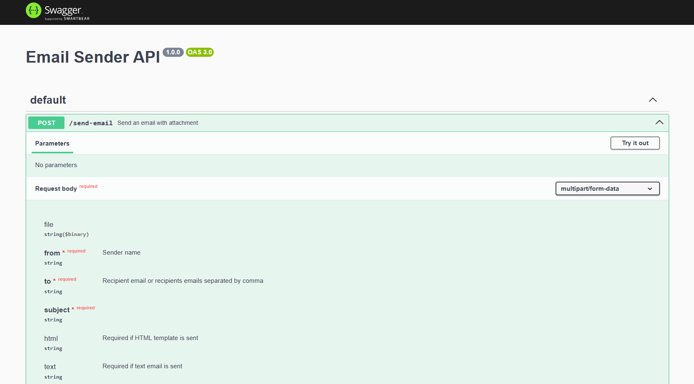

# Email Sender API

A lightweight API for sending emails in plain text or HTML templates, with optional file attachment.

## Features

- Send emails in plain text or HTML format
- Attach files
- Secure authentication using Gmail App Passwords
- CORS and API key protection
- Ready to run with Docker or locally

## Notes

The sender email must be a Gmail address.
If you need to use another SMTP provider, update the transport configuration in
./src/utils/mailer.js according to the Nodemailer documentation

## Tech Stack

[Express](https://expressjs.com/)

[Docker Compose](https://docs.docker.com/compose/)

[Swagger UI](https://swagger.io/tools/swagger-ui/)

[Nodemailer](https://expressjs.com/)

## Prerequisites

[Node.js](https://nodejs.org/)

[Docker (optional)](https://www.docker.com/)

## Instructions

### 1. Generate a Gmail App password

https://myaccount.google.com/apppasswords

### 2. Create .env file and set the following variables

```
ENVIROMENT=local
PORT=9000
LOG_LEVEL=debug
SMTP_EMAIL=example@gmail.com
SMTP_PASS="google app pass"
API_KEYS="api_key"
ALLOWED_CORS_DOMAINS="http://localhost:9000,http://otherdomain"
```

### 3. Run the app

#### Local

```
npm i
```

```
npm run dev
```

#### Docker

```
docker compose build
```

```
docker compose up
```

### 4. Access the API

App available at port 9000 (or defined port in enviroment variables)

http://localhost:9000

## API Docs

API documentation is served at:

http://localhost:9000/api-docs


